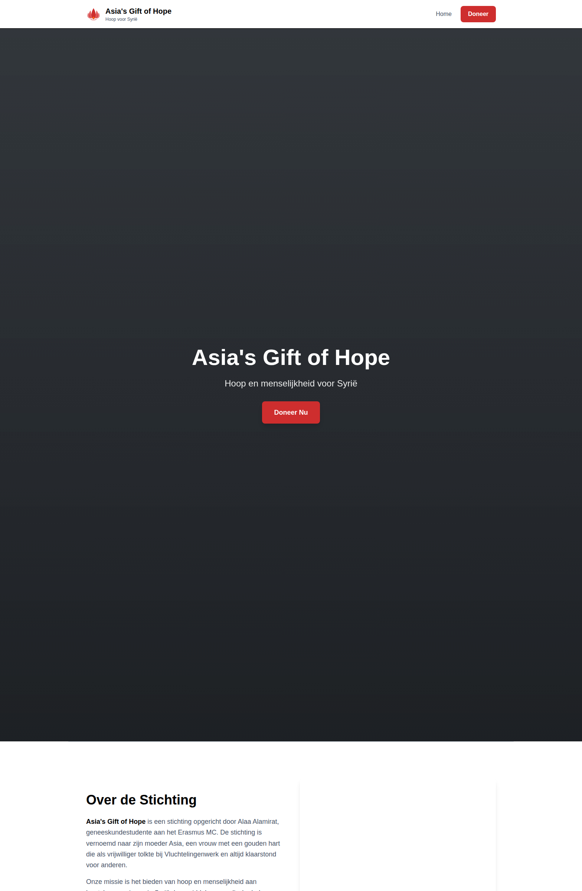
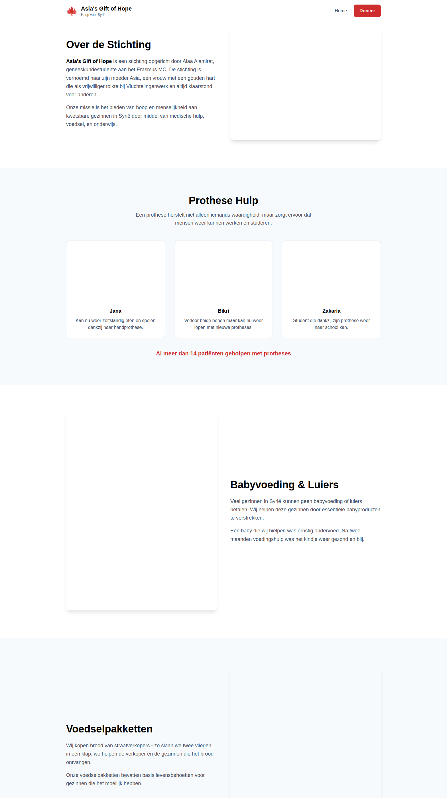
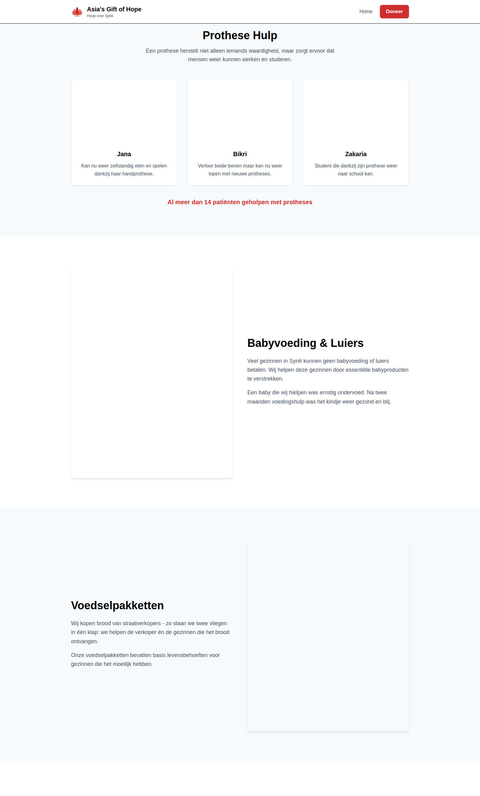
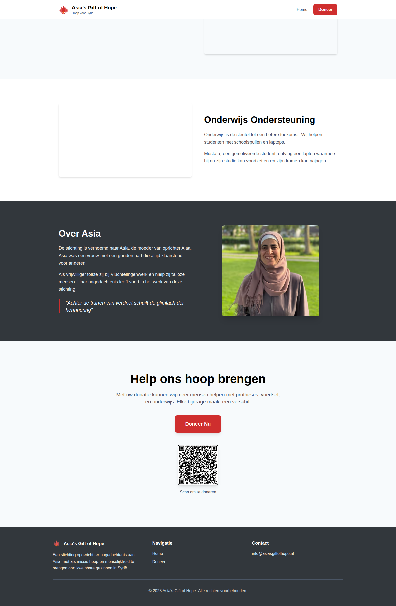
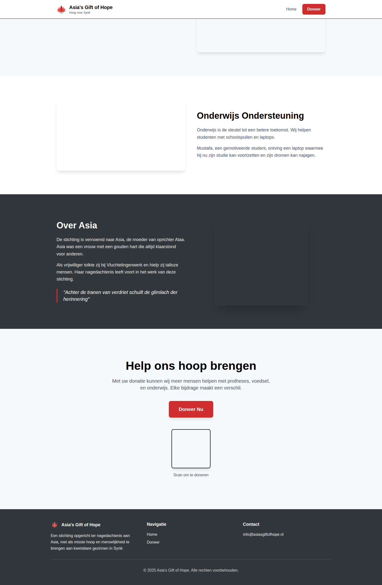
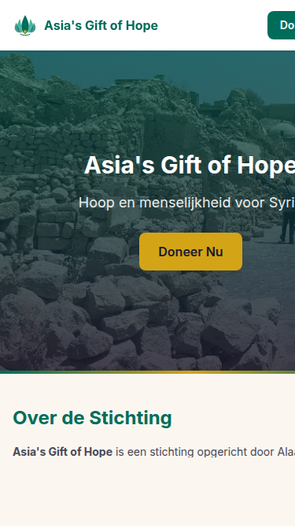
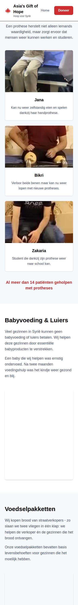

# Screenshots - Redesign Color Styling

Deze screenshots tonen het nieuwe kleurenschema en styling van de website.

## Desktop versies

### Hero sectie

### Over Ons sectie

### Prothese Hulp sectie (met nieuwe card styling)

### Over Asia sectie

### Doneer Call-to-Action

## Mobiele versies

### Hero sectie - mobiel

### Prothese Hulp sectie - mobiel

## Belangrijkste wijzigingen

- **Kleurenschema**: Van Midden-Oosterse kleuren naar modern wit/grijs/rood
- **Achtergronden**: Wit en lichtgrijs (#ffffff, #f7fafc)
- **Primaire kleur**: Warm rood (#cf2e2e)
- **Secundaire kleur**: Oranje (#ff6900)
- **Tekst**: Zwart (#000000) met grijze subtekst (#4a5568)
- **Knoppen**: Donkergrijs (#32373c) en rood (#cf2e2e)
- **Cards**: Subtiele borders en shadows met verbeterde hover effecten
- **Typography**: Betere hiërarchie en leesbaarheid
