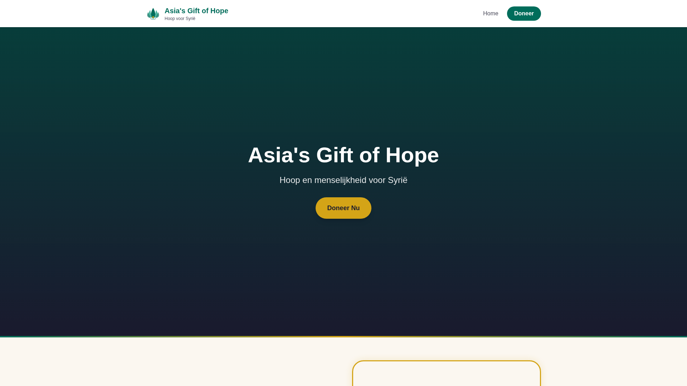
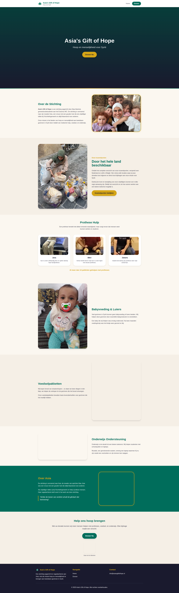
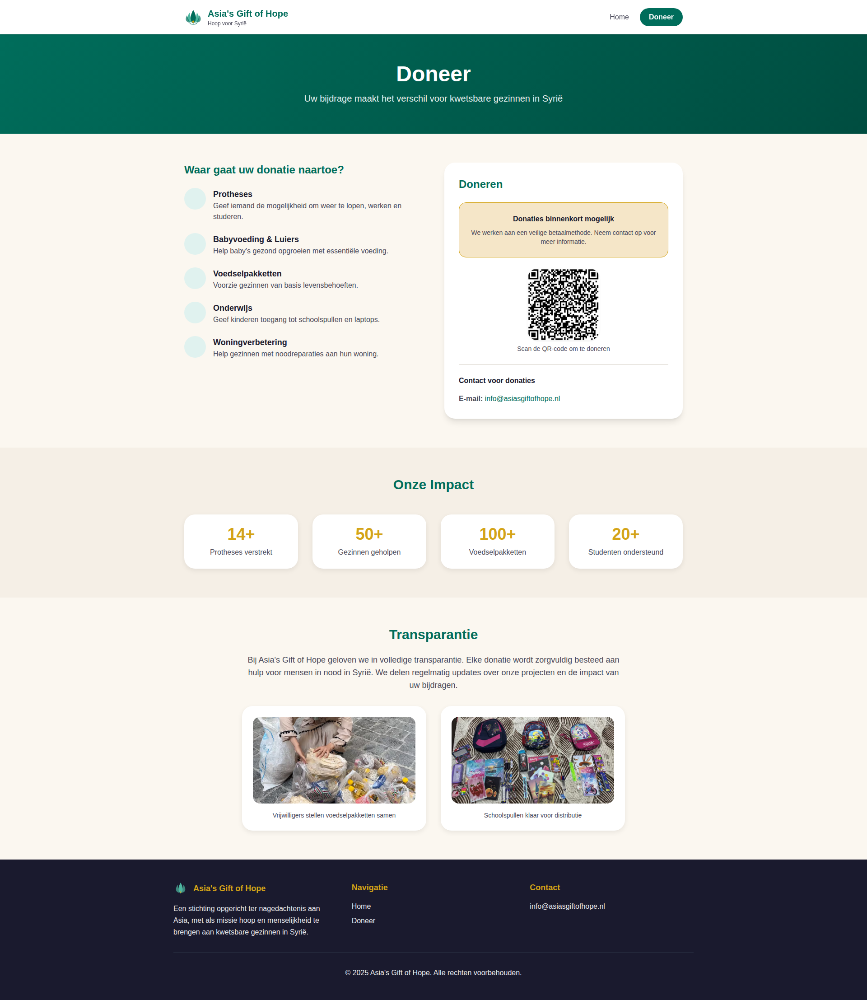

# Eastern Redesign Screenshots

These screenshots show the redesigned website with Eastern/Oriental styling and rounder elements.

## Screenshots

### 1. Homepage Hero Section

- Fully rounded "Doneer Nu" button (pill-shaped)
- Clean hero section with video background

### 2. Homepage Full Page

- New "Onze inzamelpunten" (Collection Points) section added
- All images with rounded-3xl styling (very rounded corners)
- Cards with 1.5rem border radius and enhanced shadows
- Gold borders with rounded corners and glow effects
- Circular icon containers (rounded-full)

### 3. Donation Page

- All icon containers are circular (rounded-full)
- Donation info box with rounded-3xl styling
- QR code with rounded corners
- Enhanced card shadows and hover effects

## Key Changes

- **Buttons**: All buttons now use `border-radius: 9999px` (fully rounded/pill-shaped)
- **Cards**: Border radius increased from `0.5rem` to `1.5rem` with better shadows
- **Images**: All images use `rounded-3xl` for softer, more organic feel
- **Icons**: All icon containers are now circular instead of square
- **Gold borders**: Enhanced with rounded corners and subtle glow effect

## Date
January 7, 2026
